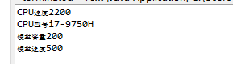

# Java-
Java课程作业项目仓库

# 阅读程序
public static void main(String args[]) {
	  //创建一个CPU对象
		CPU cpu =new CPU();
	  //将cpu的speed设置为2200
	    cpu.setSpeed(2200);
	  //cpu型号  
	    cpu.settype("i7-9750H");
	  //创建一个HardDisk对象
	    HardDisk disk=new HardDisk();
	  //将disk的amount设置为200
	    disk.setAmount(200);
	  //硬盘读写速度 
	    disk.setspeed2(500);
	  //创建一个PC对象
	    PC pc=new PC();
	    pc.setCPU(cpu);
	    pc.setHardDisk(disk);
	    pc.show();
	 }
## 实验目的
用类描述计算机中的CPU的速度和硬盘的容量。要求Java应用程序有4个类，名字分别是PC、CPU、HardDisk和Test，其中Test是主类。

## 实验过程
先创建PC类、CPU类、HardDisk类并将他们其中的参数赋值，在创建Test类，在main方法中创建对象并赋值及调用。
## 核心方法
1.方法的调用
2.Private的使用
3.参数的赋值

## 实验结果

## 实验感想
通过本次实验，我初步了解到了Java的基本功能，这为我之后的学习打下了很好的基础，其中也是学习到了如何创建对象，如何给对象赋值，如何调用方法等等。这也为我学习Java增添了信心，相信我会更上一步。
